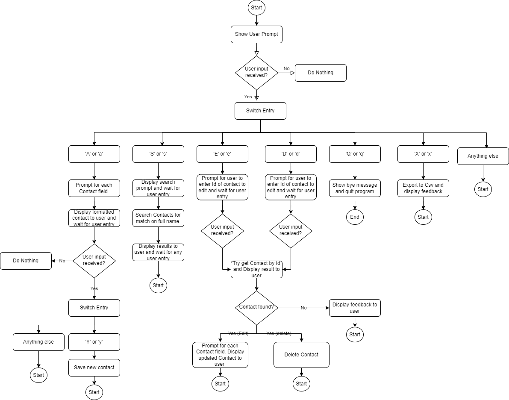

# Sample Project for Managing Contacts

## Validation of User Entries

All entries are truncated to max length of 60. 
No feedback is given because entries longer than that would be malicious so feedback would be unnecessary complication

Contact must have a first and last name entered

Phone numbers and emails are given basic validation check. 
If either is an invalid format then the user is prompted to check the value and its isValid flag is set to false. 
The validation is deliberately lenient. In my experience is it commercially better to gather data and mark it as valid or otherwise.
This allows our commercial people to try to get in touch with a contact and add/correct missing and invalid details
When an email or SMS send is attempted then the send response should be checked.If the response shows that the email/phone number is not real 
then the IsValid flag should be set false to prevent further sends to save money for client and to prevent loss of email send reputation

UK address requires minimum of first line of address, town/city and postcode to be able to send mail. 
If any of these are missing then the address isValid flag is set to false

 # Formatting of User Entries

Entries are whitespace trimmed as needed

Names are given leading capitals. OTher letters are unchanged as some Nems can have capitals in the middle

Postcodes are formatted to UK standard.

Phone numbers and emails have whitespace removed

Emails are lower cased

## To Build and run in VS Studio

open solution file (ContactManagement.sln) in a version of VS Studio that supports .Net 8

Build and debug/run

## Instructions to run

Run this executable file to start console application:

ContactManagement\bin\Debug\net8.0\ContactManagement.exe

Follow the instructions in the console

## Github

This code is available at 

https://github.com/judewood/ContactManagement

## Not Yet Implemented

Unit tests require completion

Logging outputs required

